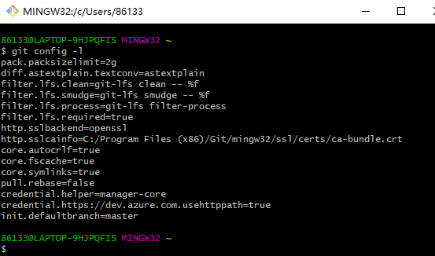
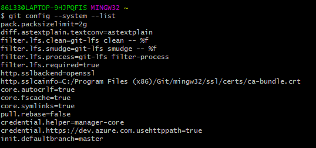
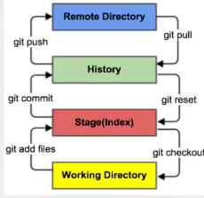
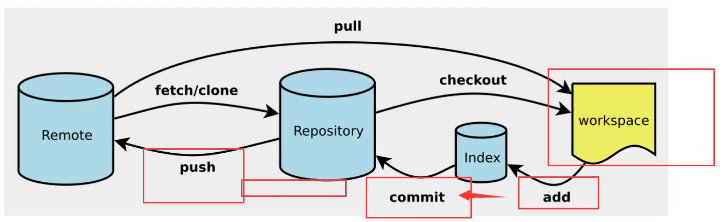
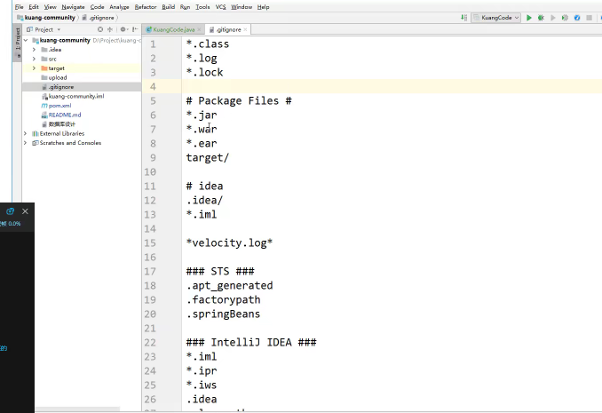
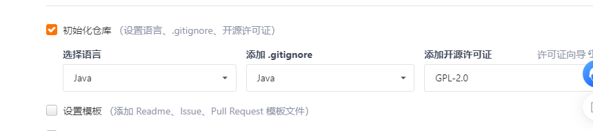
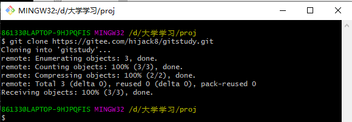
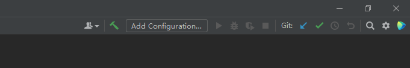

尽早上手Git，对于未来工作学习以及Github的使用帮助很大。

<!--more-->

## 版本控制

**实际上是一个版本控制工具**

可以

* 管理文件
* 目录或工程的修改历史
* 实现跨区域的多人开发
* 统计工作量
* 跟踪整个软件的开发过程

* 减小代价

常见的版本控制工具

* Git
* SVN
* CVS
* VSS
* TFS
* VisualStudioOnline


SVN是一个集中版本控制 

GIT 是一个分布式版本控制

Git不会因为服务器损坏或者网络问题而不能工作


## 安装

安装成功后会有


* Git Bash unix和linux风格命令行
* Git CMD  windows风格命令行
* Git GUI 不用

## git配置

系统配置

```
git config -l
```



查看本地的配置

```
git config --system --list
```



查看全局配置

```
git config --global --list
```

所有的配置文件其实都保存在本地


## 设置用户

```
git config --global user.name "名字"
git config --global user.email 1286285985@qq.com
```

环境变量是为了在任何地方可以使用

# Git基本理论

## 工作区域

* 工作目录
* 暂存区
* 资源库



Workspace 工作区 平时存放项目代码的地方

Index/Stagezan暂存区 临时存放改动 实际上只是一个文件

 Repository 仓库区 存放安全数据的位置 这里有提交到所有版本的数据 HEAD指向最新放入仓库的版本

Remote 远程仓库 托管代码的服务器 用于远程数据交换


.git是一个隐藏文件夹

## 工作流程

1. 在工作目录中添加修改文件  UserMapper.xml
2. 将需要进行版本管理的文件放入暂存区   git add .   (有个点)
3. 将暂存区域的文件提交到git仓库    git commit 

推到远程

# git项目搭建

一种是在本地新建仓库 另一种是科隆远程仓库



## 本地

```
git init
```

初始化项目  生成.git文件

## 远程

```
git clone url
```

下载远程项目

## Git文件操作

文件状态

* Untracked  没有加入到git
* Unmodify 文件入库未修改
* Modified 文件已修改 没有进行其他操作
* Stage 通过git add可以进入暂存区 通过git commit可以将修改同步到库中

```
git status
```

查看文件的状态


```
git add .    进入暂存区
```


```
git commit -m "消息内容"    提交暂存区的内容到本地仓库 -m是提交消息
```


前端项目中以及后端项目中好多都不需要提交

## .gitignore文件



```
*.txt 
.idea/    idea文件夹下所有文件
tmp/
```


# 使用github gitee

在国内一般使用gitee

公司中有时会搭建自己的git服务 GitLab

作为未来找工作的重要信息


## SSH设置免密登录

码云是远程 我们平时工作在本地仓库

```
ssh-keygen -t rsa
```


新建仓库



许可证：开源是否可以随意转载 开源但是不能随意

将仓库克隆到本地



# 使用idea集成git

项目的目录是我们的git目录

1. 新建项目 绑定git

* 远程git目录拷贝过来

2. 修改文件使用idea操作git

* 添加到暂存区
* commit提交  主要是提交一个变化信息
* push 到远程

3. 提交测试



idea集成了git的基本操作

这样文件就绑定成功了

绑定成功后可以add 到暂存区 然后commit到本地 再push至远端


# Git分支

master分支  主分支

分支是用来干嘛的？

* master 主
* dev 开发
* v4.0 版本
* 多个分支如果并行执行会导致我们代码不冲突，也就是同时存在多个版本

web-api   A组

web-admin  B组  会调用A(修改A代码)

web-app  C组会调用B和A

如果冲突就需要协商

## 冲突是什么？

例如两个分支修改了同一个文件就会导致冲突，冲突之后是无法进行合并操作的。

必须要先解决冲突，再进行合并。

```
git branch     查看分支
git branch -r 远程分支
git branch dev
git merge [branch]

```

