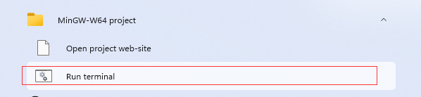

vscode中配置C/Cpp环境。

<!--more-->

## 下载mingw

## mingw如何使用

如果我们不使用vscode，可以直接使用命令行编译代码。

打开mingw终端，

直接gcc 相应文件

即可生成对应的exe可执行文件。

我们直接运行即可。

## 配置vscode

ctrl + shift + p 选择

然后只需要将mingw的bin文件夹位置添加到系统环境变量中即可。

